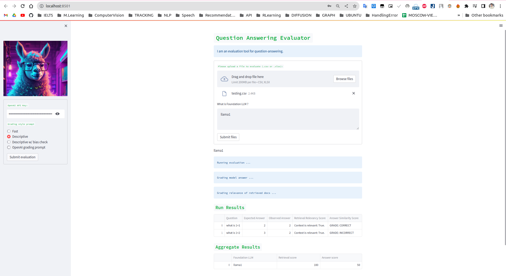

# Auto Evaluator for Opensource LLMs

This repo is built on top of Streamlit

## 🚀 Features

This is a lightweight evaluation tool for `text-retrieval` and `question-answering` using Langchain

This tool is designed to assess the performance of various LLMs for QA task

## Integrations :

- [ ] LLMs
  - [x] GPT-3.5-turbo
  - [ ] GPT-4
  - [ ] Anthropic
## Setup instructions 
This app is built with Python 3.10 . Clone this repo and follow the steps below to get started 

### 
<details open>
  <summary style="font-size: 18px; font-weight: bold; "> Running everything with Docker </summary><br>

```bash
docker compose up --build -d  
```
</details>

<details>
  <summary style="font-size: 18px; font-weight: bold;">Running without Docker </summary><br>


#### Create virtual environment and install dependencies 
```bash
python3 -m venv venv
source venv/bin/activate
python3 -m pip install --upgrade pip setuptools wheel
python3 -m pip install -e ".[dev]"

```
Or you can create Python virtual environment with Makefile
```bash
make venv
```

#### Start FastAPI server:
```bash
streamlit run auto-evaluator.py 
```

####  Start Panel UI:
```bash
panel serve dashboard_panel/app_panel.py     
```


</details>

## Demo Applications and Usage Instruction

### Streamlit UI 

Open http://localhost:8501 in your browser to access the tool.


Enter the OpenAI API Key in the left sidebar, select `Grading style prompt` and then click the `Submit evaluation `button.

Afterward, upload the `CSV` file with the following format, along with the names of the foundation LLMs for  results aggregation.

| question      | Context       | result | answer |
|---------------|---------------|--------|--------|
| what is 1+3   | 1+3=4         | 3      | 4      |
| what is 1+2   | 1+2=3         | 3      | 3      |
